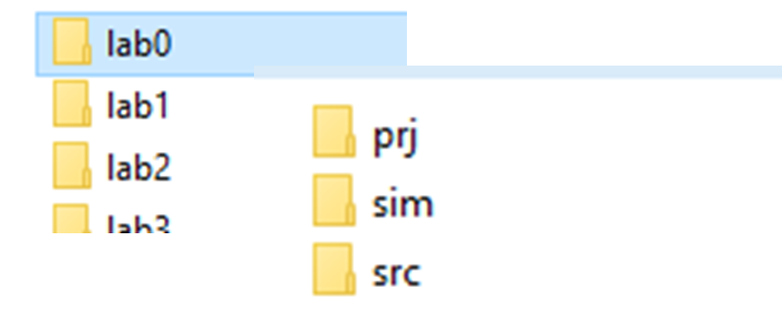

# LABORATÓRIOS

- UM PROJETO (ex.: ULA, processador, etc) -> UMA PASTA
- Subpastas letras minúsculas .Subpastas para cada etapa (prj, sim, src e doc)
- Nome das pastas e subpastas sem espaço ·Arquivo de projeto com final  <nome>_prj
- Observe a Hierárquia -> ter em mente que projetos complexos possui um arquivo de topo (pai) e

